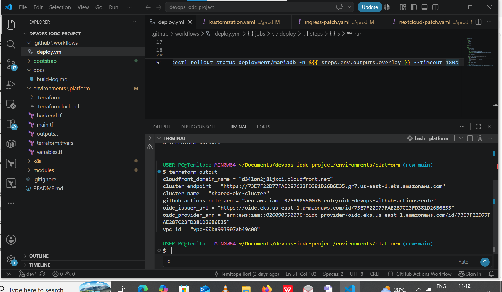
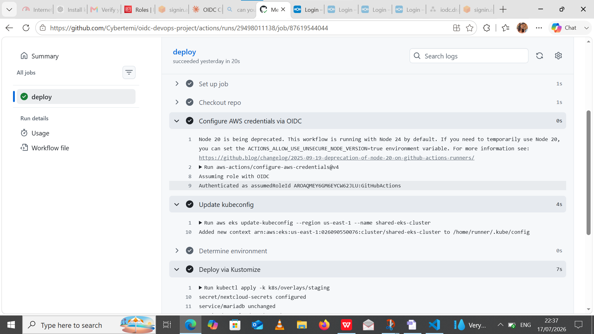
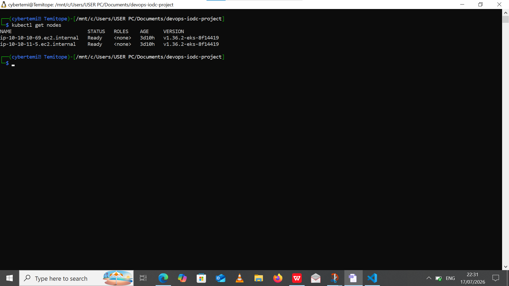
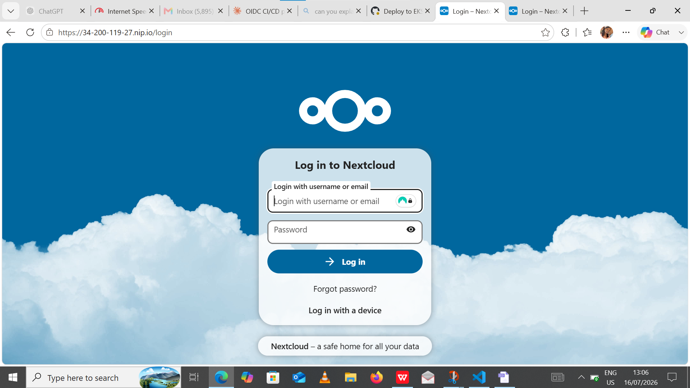
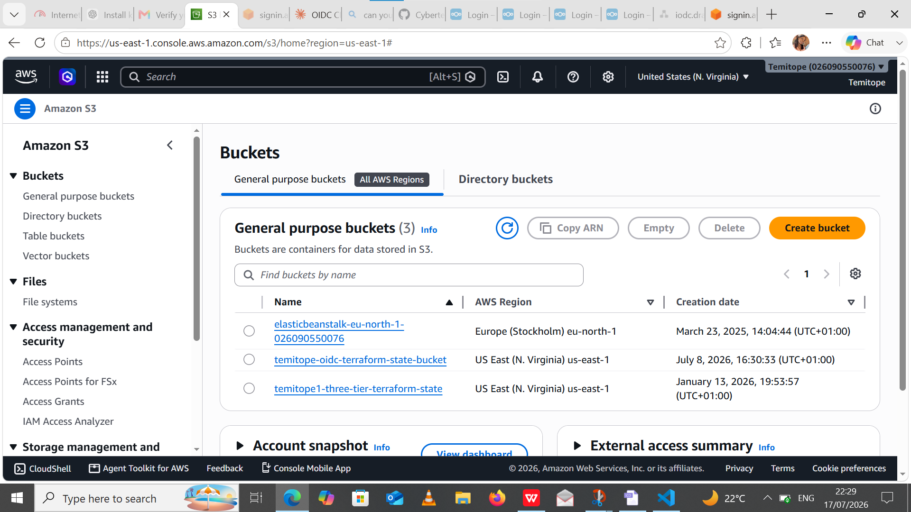
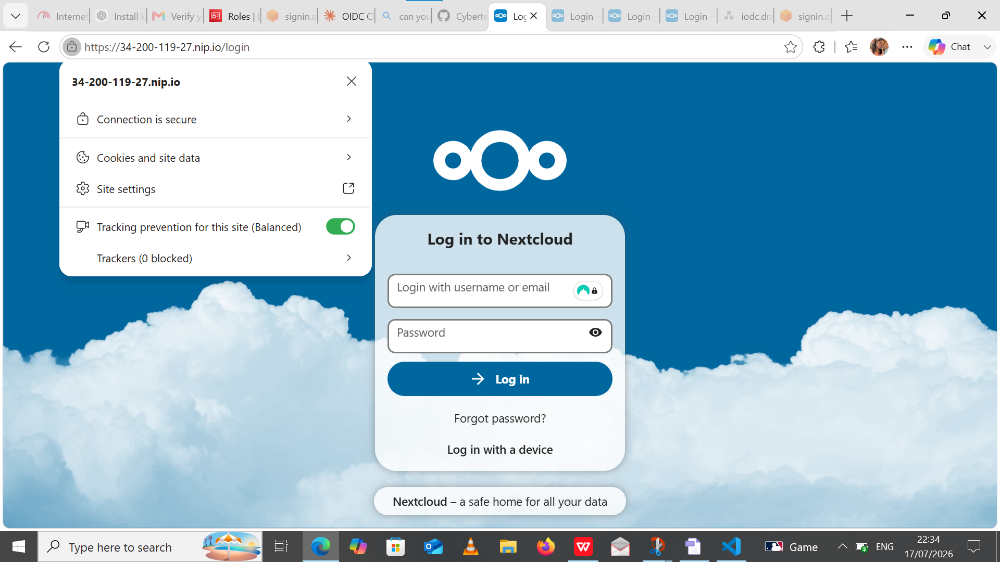

# Production-Ready AWS DevOps Platform with Terraform, Amazon EKS, GitHub OIDC & CloudFront

# Nextcloud on Amazon EKS with GitHub OIDC, IRSA & CloudFront

A production-inspired DevOps project demonstrating how to provision, secure, and automate the deployment of a multi-environment Kubernetes platform on AWS using Infrastructure as Code and modern cloud-native practices.

The platform provisions AWS infrastructure with Terraform, deploys Nextcloud on Amazon EKS, secures CI/CD using GitHub OpenID Connect (OIDC), implements IAM Roles for Service Accounts (IRSA) for Kubernetes workloads, automates TLS certificate management with cert-manager and Let's Encrypt, and delivers content through Amazon CloudFront.

> **This project demonstrates production-oriented DevOps practices including Infrastructure as Code, Kubernetes, CI/CD, cloud security, and multi-environment deployments.**


# Key Features

* Infrastructure provisioned using **Terraform**.
* Shared **Amazon EKS** cluster with namespace isolation (`dev`, `staging`, `prod`).
* Secure CI/CD using **GitHub Actions + OpenID Connect (OIDC)** without long-lived AWS credentials.
* **IRSA** configured for the Amazon EBS CSI Driver.
* Automated TLS certificate management using **cert-manager** and **Let's Encrypt**.
* Application routing through **NGINX Ingress Controller**.
* Content delivery using **Amazon CloudFront**.
* Multi-environment deployments using **Kustomize overlays**.
* Remote Terraform state stored in **Amazon S3** with **DynamoDB locking**.

---

# Technology Stack

| Category            | Technologies                |
| ------------------- | --------------------------- |
| Cloud               | AWS                         |
| IaC                 | Terraform                   |
| Container Platform  | Kubernetes, Amazon EKS      |
| CI/CD               | GitHub Actions              |
| Authentication      | GitHub OIDC                 |
| Kubernetes Identity | IRSA                        |
| Package Manager     | Helm                        |
| Configuration       | Kustomize                   |
| Ingress             | NGINX Ingress Controller    |
| Certificates        | cert-manager, Let's Encrypt |
| CDN                 | Amazon CloudFront           |
| Storage             | Amazon EBS CSI Driver       |
| State Backend       | Amazon S3 & DynamoDB        |

---

# Repository Structure

```text
.
├── bootstrap/
├── environments/
│   └── platform/
├── modules/
│   ├── networking/
│   ├── eks/
│   ├── github-oidc/
│   └── cloudfront/
├── k8s/
│   ├── base/
│   ├── overlays/
│   ├── storageclass.yaml
│   └── cluster-issuer.yaml
└── .github/workflows/deploy.yml
```

---

# Deployment Workflow

### 1. Bootstrap the Terraform Backend

```bash
cd bootstrap

terraform init
terraform plan
terraform apply
```

Creates the Amazon S3 backend for Terraform state and the DynamoDB lock table.

---

### 2. Provision AWS Infrastructure

```bash
cd environments/platform

terraform init
terraform plan
terraform apply
```

This deploys:

* Amazon VPC
* Public & Private Subnets
* NAT Gateway
* Amazon EKS Cluster
* Managed Node Group
* GitHub OIDC Provider
* IAM Roles
* CloudFront Distribution

---

### 3. Configure kubectl

```bash
aws eks update-kubeconfig \
  --region us-east-1 \
  --name shared-eks-cluster

kubectl get nodes
```

---

### 4. Install Cluster Components

```bash
helm repo add ingress-nginx https://kubernetes.github.io/ingress-nginx

helm repo add jetstack https://charts.jetstack.io

helm repo update

helm install ingress-nginx ingress-nginx/ingress-nginx \
  --namespace ingress-nginx \
  --create-namespace

helm install cert-manager jetstack/cert-manager \
  --namespace cert-manager \
  --create-namespace \
  --set installCRDs=true
```

Then apply:

```bash
kubectl apply -f k8s/storageclass.yaml
kubectl apply -f k8s/cluster-issuer.yaml
```

---

### 5. Deploy Applications

```bash
kubectl apply -k k8s/overlays/dev

kubectl apply -k k8s/overlays/staging

kubectl apply -k k8s/overlays/prod
```

---

# CI/CD Pipeline

```
Developer Push
      │
      ▼
GitHub Actions
      │
OIDC Authentication
      │
Assume AWS IAM Role
      │
Update kubeconfig
      │
kubectl apply -k
      │
Deploy to EKS
```

| Branch  | Environment |
| ------- | ----------- |
| dev     | Development |
| staging | Staging     |
| main    | Production  |

---

# Security

This project follows modern cloud security practices by implementing:

* GitHub OpenID Connect (OIDC)
* Zero long-lived AWS credentials
* IAM Roles for Service Accounts (IRSA)
* Least-Privilege IAM Policies
* Remote Terraform State with S3 & DynamoDB
* Automated TLS Certificates
* Namespace isolation for environments

---

# Engineering Decisions

* **Shared EKS Cluster:** A single EKS cluster with namespace isolation was chosen instead of three separate clusters to reduce operational complexity and AWS costs.
* **GitHub OIDC:** Eliminated the need to store AWS access keys in GitHub Secrets.
* **IRSA:** Applied to the Amazon EBS CSI Driver to provide secure, pod-level AWS permissions.
* **Kustomize:** Used to manage environment-specific configurations while maintaining a shared application base.
* **CloudFront:** Added to improve content delivery and simulate a production-ready architecture.

---

## Screenshots

### Infrastructure Provisioning



### CI/CD Pipeline



### Amazon EKS



### Application



### Terraform Remote State

Terraform state is stored remotely in Amazon S3, with state locking implemented using DynamoDB.


### Application with HTTPS

The deployed application is accessible over HTTPS using a TLS certificate provisioned and managed by cert-manager.



# Challenges & Lessons Learned

During development, I gained hands-on experience with:

* Configuring GitHub OIDC trust relationships for secure CI/CD.
* Implementing IRSA for Kubernetes workloads.
* Troubleshooting cert-manager and Let's Encrypt certificate issuance.
* Managing Kubernetes Ingress resources with Kustomize overlays.
* Understanding Amazon EKS Access Entries and Kubernetes authorization.
* Designing a reusable, modular Terraform codebase.

---

# Future Improvements

* GitOps with Argo CD
* Prometheus & Grafana Monitoring
* Loki Log Aggregation
* AWS WAF Integration
* ExternalDNS with Route53
* Horizontal Pod Autoscaler
* Velero Backup & Disaster Recovery


# Author

**Temitope Ilori**


* GitHub: https://github.com/Cybertemi
* LinkedIn: https://www.linkedin.com/in/iloritemi


